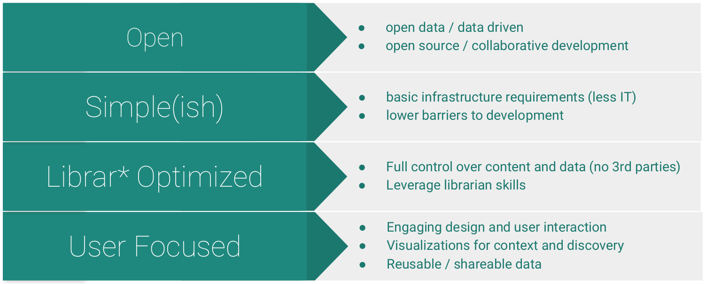

# Lib-STATIC

> **methodology in progress!**

See [CollectionBuilder](https://collectionbuilder.github.io/) and [Oral History as Data](https://github.com/uidaholib/oral-history-as-data) for our works in progress.

Lib-STATIC is a minimal computing-based approach to creating data-driven tools leveraging static-web technologies (enabled by generators such as Jekyll and a "JAM" stack approach) and librarians’ specialized skills in metadata and classification to create engaging web publications via three components: a spreadsheet with well-formed metadata, a directory of assets, and a configuration file. 

# Why?

In response to challenges and frustrations with the systems we used daily, we started to see that there were ways to build these systems and tools that did not lock us into proprietary contracts nor lock us out of the code and data driving the site's presentation. 
These experiences led us to a philosophy of development that leverages the expertise of librarians and cultural heritage workers and the unique values of their institutions at the forefront of project design decisions.
This methodology differs greatly from the predominant model for platform and tool building for academic libraries as it does not require complex infrastructure nor specialized developers to build, implement, and maintain the systems put into use.
The shift towards a focus on clean data and simple systems enables a more agile and responsive approach, allowing the iterative development of features, gradual acquisition of developer skills, and flexible migration between hosts without the need for deep investment. 

We recognize that there will still be learning curves and frustrations in the development and use of any system, regardless of its underlying methodology. 
However, with its focus on the primary values of usability and accessibility, Lib-STATIC gives libraries and cultural institutions the framework within which to develop and use tools that actually embody their principles by removing the overwrought features and extensive infrastructure requirements that permeate many of the library systems currently used and developed.

